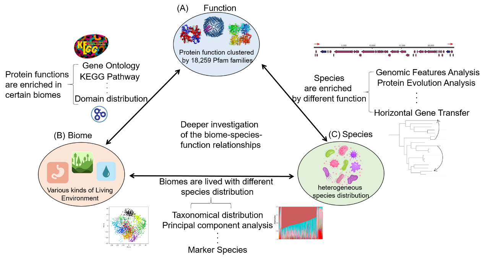

# Investigation of biome–species–function relationship

This repository is the source code and intermediate results for the research "Microbiome-based enrichment pattern mining has enabled a deeper understanding of the biome–species–function relationship".

This repository is constructed for the researchers to reproduce the results of the metagenome analysis and enrichment model construction in the research "Microbiome-based enrichment pattern mining has enabled a deeper understanding of the biome–species–function relationship".
Microbes live in diverse habitats (i.e. biomes), yet their species and genes were biome-specific, forming enrichment patterns. These enrichment patterns have mirrored the biome–species–function relationship, which is shaped by ecological and evolutionary principles. However, a grand picture of these enrichment patterns, as well as the roles of external and internal factors in driving these enrichment patterns, remain largely unexamined. In this work, we have examined the enrichment patterns based on 1,705 microbiome samples from four representative biomes (Engineered, Gut, Freshwater, and Soil), aiming towards creating a bluebook of the biome–species–function relationships. Moreover, an “enrichment sphere” model was constructed to elucidate the regulatory principles behind these patterns. The driving factors for this model were revealed based on two case studies: (1) The copper-resistance genes were enriched in Soil biomes, owing to the copper contamination and horizontal gene transfer. (2) The flagellum-related genes were enriched in the Freshwater biome, due to high fluidity and vertical gene accumulation. Furthermore, this enrichment sphere model has valuable applications, such as in biome identification, and in guiding 3D structure modeling of proteins. In summary, the enrichment sphere model can decode the biome–species–function relationship, leverage the influence factors of this relationship, and be applied in many fields. 

## Workflow for our research

Workflow for the examination of the “biome-species-function” relationship. To explore the association between function(A) and biome(B), the gene annotation for functional genes in various biomes will be annotated by aligning to different functional annotation databases, such as the GO database, KEGG pathway. For the research of the association between biome(B) and species(C), a comprehensive set of comparative taxonomical analyses should be undertaken to determine the divergent species distribution in various biomes. For exploring the link between function(A) and species(C), the genome analysis is done to explore the function distribution for a genome.

## Enrichment model constructed in our research

Figure 2. Functional gene enrichment in biomes as determined by GO annotation term analysis. In (A) and (B), the label of samples were assigned based on the result of enrichment analysis. The term “other” refers to protein domains that are not significantly enriched (P-value>0.5) in any of the four biomes. (A) Protein domain enrichment in four biomes. The heatmap illustrates the distribution of protein domains according to their enriched biomes. Each row means a protein domain and each column means a metagenome sample, grouped by their biome. (B) PCoA results for samples from the four biomes based on the protein domain distribution. Samples from the same biome are labeled with the same color. Circles indicate the confidence intervals for samples from the same biome. (C) The enrichment of functions in the four biomes based on a cluster of GO annotations. The proportions of the four biomes in a GO annotation are labeled on corresponding GO annotations in pie chart form. A cluster of GO annotations enriched in a specific biome is annotated by a colored polygon in the background fill to represent this enrichment pattern, one color for each biome. The enriched sphere was labeled with “**” for P-value<0.01. And representative clusters are also annotated by text, for example, “Soil-enriched ion binding”.

## Summary

  - [Repository structure](#getting-started)
  - [Prerequisites](#Prerequisites)
  - [Usage](#Usage)
  - [Authors](#authors)
  - [License](#license)

## Repository structure

These instructions will get you a copy of the project up and running on
your local machine for development and testing purposes. See deployment
for notes on how to deploy the project on a live system.
```reStructuredText
├── data                                        Intermediate file for the analysis of biome–species–function relationship 
│   ├── 3Dstructure                             3D structure model and multiple sequences alignment for PF05425 and PF12597
│   │   ├── PF05425.hhba3m                      Multiple sequence alignment in a3m format 
│   │   ├── PF05425.hhbaln                      Multiple sequence alignment in aln format
│   │   ├── PF05425.hmsa3m                      Multiple sequence alignment for C-QUARK 
│   │   ├── PF05425.hmsaln                      Multiple sequence alignment for C-QUARK
│   │   ├── PF05425.jaca3m                      Multiple sequence alignment for C-QUARK
│   │   ├── PF05425.jacaln                      Multiple sequence alignment for C-QUARK
│   │   ├── PF05425.pdb.gz                      3D structure for PF05425 after supplementing by metagenome from soil biome 
│   │   ├── PF12597.hhba3m                      Multiple sequence alignment in a3m format 
│   │   ├── PF12597.hhbaln                      Multiple sequence alignment in aln format
│   │   ├── PF12597.hmsa3m                      Multiple sequence alignment for C-QUARK 
│   │   ├── PF12597.hmsaln                      Multiple sequence alignment for C-QUARK 
│   │   ├── PF12597.jaca3m                      Multiple sequence alignment for C-QUARK 
│   │   ├── PF12597.jacaln                      Multiple sequence alignment for C-QUARK 
│   │   └── PF12597.pdb.gz                      3D structure for PF05425 after supplementing by metagenome from soil biome 
│   ├── file1_supplementary table S4.xlsx       List of the project for four biomes and related information.
│   ├── file2_the details of MAGs.xlsx          Detail information for the assembled metagenome bins
│   ├── file3_lake_Flagellum_gene_location.csv  The gene location of Flagellum genes used in our project
│   ├── file4_soil_cop_family_gene_location.csv The gene location of cop genes used in our project
│   └── GO_annotation                           The folder retrieving the GO annotation in four biomes 
│       ├── Fermentor_BP.csv                    The GO annotation identified as Biological Process in Fermentor biome
│       ├── Fermentor_CC.csv                    The GO annotation identified as Celluar Composition in Fermentor biome
│       ├── Fermentor_MF.csv                    The GO annotation identified as Molecular Function in Fermentor biome
│       ├── Gut_BP.csv                          The GO annotation identified as Biological Process in Gut biome
│       ├── Gut_CC.csv                          The GO annotation identified as Celluar Composition in Gut biome
│       ├── Gut_MF.csv                          The GO annotation identified as Molecular Function in Gut biome
│       ├── Lake_BP.csv                         The GO annotation identified as Biological Process in Lake biome
│       ├── Lake_CC.csv                         The GO annotation identified as Celluar Composition in Lake biome
│       ├── Lake_MF.csv                         The GO annotation identified as Molecular Function in Lake biome
│       ├── Soil_BP.csv                         The GO annotation identified as Biological Process in Soil biome
│       ├── Soil_CC.csv                         The GO annotation identified as Celluar Composition in Soil biome
│       └── Soil_MF.csv                         The GO annotation identified as Molecular Function in Soil biome
├── img                                         The figure about workflow and enrichment model 
│   ├── overview.png                            The overview of biome–species–function relationship
│   └── Figure2.png                             The enrichment model
└── script                                      The analysis script for the analysis of biome–species–function relationship
    ├── 1_metagenomeanalysis                    The script for visulazation of the metagenome taxonomical composition
    │   ├── 1_relative_abundance_.R             The script for the visulazation of relative abundance of four biomes
    │   ├── 2_PCoA.R                            The PCoA analysis for the samples from four biomes
    │   └── 3_heatmap.R                         Heatmap for the illustration of the distribution of protein domains
    ├── 2_enrichmentanalysis                    Scripts for the enrichment analysis
    │   ├── hypergeometric.R                    Script for the hypergeometric
    │   ├── MULTI_HYPERGEO_TEST.R               Script for the multi-hypergeometric analysis
    │   └── shaped2048.csv                      Example input for the enrichment analysis
    ├── 3_Figure3and4                           Scripts for the Figure 3 and Figure 4
    │   └── 1_gene_location.R                   Script for Gene location illustration
    └── 4_3D structure prediction               Script for the MSA construction and 3D structure prediction 
        ├── example                             Example for the MSA constructed by different dataset
        │   ├── PF02677.hmm.ferm_fasta          MSA constructed by data from Engineered biome
        │   ├── PF02677.hmm_gut.fasta           MSA constructed by data from Gut biome
        │   ├── PF02677.hmm.lake_fasta          MSA constructed by data from Lake biome
        │   ├── PF02677.hmm_soil.fasta          MSA constructed by data from Soil biome
        │   ├── PF02677.merged.fasta            MSA constructed by data from four biomes
        │   ├── results                         MSA counstruced by DeepMSA
        │   │   ├── PF02677.deepa3m             MSA in a3m format
        │   │   ├── PF02677.deepaln             MSA in alm format
        │   │   ├── PF02677.hmsa3m              MSA constructed by DeepMSA
        │   │   ├── PF02677.hmsaln              MSA constructed by DeepMSA
        │   │   ├── PF02677.nofilter.deepa3m    MSA filtered by DeepMSA
        │   │   └── PF02677.nofilter.deepaln    MSA filtered by DeepMSA
        │   └── workdir                         Workdir for DeepMSA
        │       ├── hms.db                      Search database for DeepMSA
        │       ├── hms.db.ssi                  Index for the search database
        │       ├── seq.a3m                     Aligned sequences in a3m format
        │       ├── seq.aln                     Aligned sequences in aln format
        │       ├── seq.fasta                   Aligned sequences in fasta format
        │       ├── seq.hhba3m                  Aligned sequences in hhba3m database
        │       ├── seq.hhbaln                  Aligned sequences in hhbaln database
        │       ├── seq.hmsa3m                  Aligned sequences in hmsa3m database
        │       ├── seq.hmsaln                  Aligned sequences in hmsaln database
        │       ├── seq.jaca3m                  Aligned sequences in jaca3m database
        │       ├── seq.jacaln                  Aligned sequences in jacaln database
        │       ├── seq.nofilter.a3m            Aligned sequences in a3m format without filter
        │       └── seq.nofilter.aln            Aligned sequences in aln format without filter
        ├── fix-data.py                         Fix the format errors in input data
        └── run-deepmsa.sh                      Shell script for runing DeepMSA
```

### Prerequisites

All the R script were performed under version 3.6.1
All the Python script were performed under version 3.7.1
The reqirement of package of each script is listed in the top of each script

### Usage

1.In the folder "data",intermediate files for the analysis of biome–species–function relationship were retrived.

2.For the script in folder "4_3D structure prediction":
The run-deepmsa.sh
usage: sh run-deepmsa.sh PF02677 example/PF02677.merged.fasta example/workdir example/results

-PF02677 is the target pfam family and the the name of the result folder 

-example/PF02677.merged.fasta is the collection of homologous seuqneces collected from four biomes

-example/workdir and example/result are the folder collecting the intermediate data and msa result, respectively.

## Authors

Pengshuo Yang | yangps@hust.deu.cn|Ph.D., School of Life Science and Technology, Huazhong University of Science & Technology
Xue Zhu| D201980519@hust.com|Ph.D.Candidate, School of Life Science and Technology, Huazhong University of Science & Technology
Kang Ning| ningkang@hust.edu.cn|Professor, School of Life Science and Technology, Huazhong University of Science & Technology
## License

This project is licensed under the [GNU General Public License v3.0](LICENSE.md)
Creative Commons License - see the [LICENSE.md](LICENSE.md) file for
details

